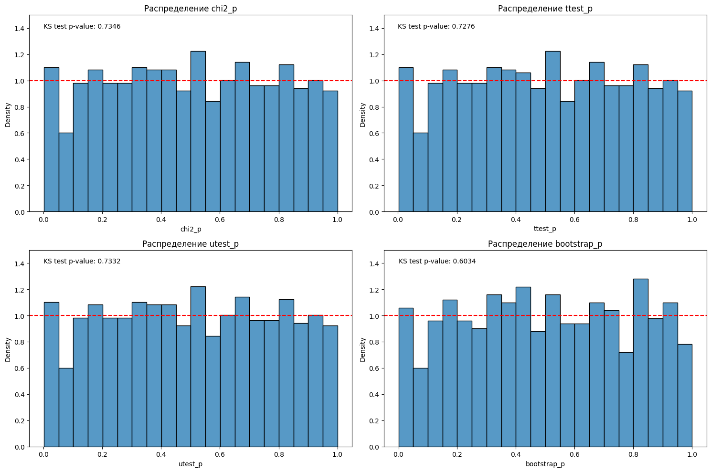
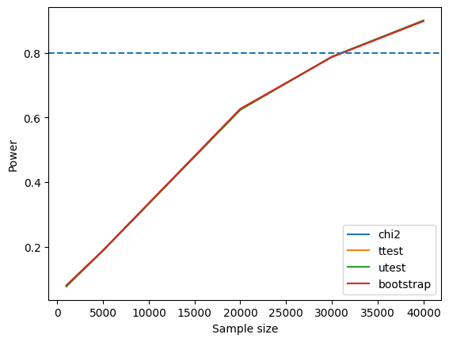

# Симуляции A/A и A/B тестов

Проверка сплитования и мощности статистических критериев.

Учебный кейс из курса по A/B-тестированию.

## Задача

Проверить частоту ложных сигналов при разбиении синтетических пользователей по хешу, затем оценить чувствительность к росту конверсии с 10% до 11%: **+1 п. п.**, или **+10% относительно базы**.

## Подход

### Симуляция A/A теста

1. Сгенерированы 10 000 пользователей с вероятностью совершения действия 10%.
2. Выполнено разбиение с вероятностями назначения 50/50 по MD5 с солью.
3. На 1 000 итерациях сравнены группы с помощью χ², t-теста Уэлша, U-теста Манна-Уитни и bootstrap.
4. Построены распределения p-value и проведён тест Колмогорова-Смирнова на соответствие равномерному распределению.

### Симуляция A/B теста

1. Сгенерированы синтетические пользователи для нескольких размеров выборки и выполнено разбиение по MD5 с солью.
2. Для тестовой группы добавлен дополнительный 1% эффект.
3. Группы сравнены с помощью χ², t-теста Уэлша, U-теста Манна-Уитни и bootstrap.
4. Мощность оценена как доля итераций с `p-value < 0.05` по 1 000 симуляций для каждого размера выборки.
5. Проверена зависимость мощности от общего количества пользователей.

## Результаты

Ниже приведены сохранённые результаты запуска из исходного ноутбука.

### A/A: распределения p-value

| Метод сравнения групп | p-value теста Колмогорова — Смирнова |
|---|---:|
| χ² | 0.7346 |
| t-тест Уэлча | 0.7276 |
| U-тест Манна — Уитни | 0.7332 |
| Bootstrap | 0.6034 |

При уровне значимости 0.05 гипотеза о равномерности не отвергается для всех четырёх методов. В этой симуляции проверка не выявила отклонения распределений p-value от равномерного; это не является доказательством корректности сплитования во всех условиях.

### A/B: мощность и размер выборки

В сохранённом запуске кривые мощности четырёх методов практически совпадают. При 20 000 пользователей мощность составляет около 63–65%, а уровень 80% достигается примерно при **30 000 пользователей суммарно**, то есть около 15 000 на группу. Это согласуется с приближённой оценкой размера выборки для роста конверсии с 10% до 11%.

Числа мощности указаны приблизительно по графику; отдельная таблица точных значений в выводах ноутбука не сохранена. Ось `Sample size` показывает суммарное количество пользователей в двух группах.

## Материалы

- [Ноутбук с кодом и сохранёнными результатами](analysis.ipynb)
- [Текстовые результаты и авторский вывод](results.txt)
- [Первоначальный график мощности для 1 000, 5 000 и 20 000 пользователей](figures/ab-power-initial.png)
- [Исходный ноутбук в Google Colab](https://colab.research.google.com/drive/1sM0mZ9gK0wvLEDRo2H5B6oJZ3Fv2Av0m)

## Запуск

Данные генерируются в коде, внешний датасет не требуется. Используются NumPy, pandas, SciPy, Matplotlib и seaborn. Запускайте ячейки последовательно; вложенные bootstrap-циклы могут выполняться долго.

Результаты повторного запуска могут немного отличаться: `np.random.seed(42)` фиксирует генератор NumPy, но не `uuid.uuid4()`, от которого зависит назначение групп.

[К обзору портфолио](../README.md)
