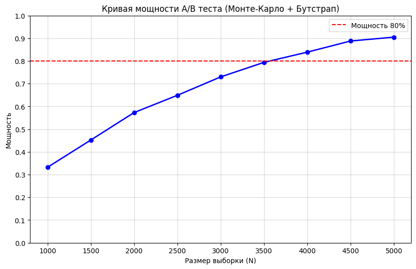
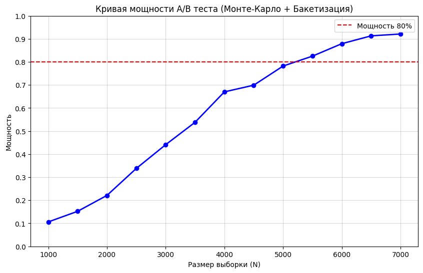

# CTR: дельта-метод, линеаризация, бутстрап и бакетизация

Учебный кейс из курса по A/B-тестированию. В кейсе представлены синтетические данные для анализа CTR.

**Метрика:** `CTR = sum(clicks) / sum(views)`.

## Задача

- По историческим данным рассчитать необходимый объём выборки для относительного MDE 10%, уровня значимости α = 0,05, мощности 80% и сплита 90/10.
- Оценить проведённый эксперимент.

## Подход

Обе задачи решены четырьмя методами: дельта-методом, линеаризацией, пуассоновским бутстрапом и бакетизацией с t-тестом Уэлча.

Для планирования дельта-метод и линеаризация используют исторические пользовательские данные. Для бутстрапа и бакетизации проведено по 1 000 симуляций на каждый проверяемый размер выборки. В бутстрапе используются 1 000 перевзвешиваний на симуляцию, в бакетизации — 50 бакетов на группу.

## Результаты: объём выборки

Сплит: 90% пользователей в контроле, 10% в тесте. MDE 10% — относительный рост CTR, а не рост на 10 процентных пунктов.

| Метод | Контроль | Тест | Всего пользователей | Основание оценки |
|---|---:|---:|---:|---|
| Дельта-метод | 2 901 | 323 | **3 224** | Аналитический расчёт |
| Линеаризация | 2 901 | 323 | **3 224** | Аналитический расчёт |
| Пуассоновский бутстрап | ≈3 600 | ≈400 | **4 000** | Первый проверенный размер с мощностью выше 80% на сохранённом графике |
| Бакетизация | ≈4 950 | ≈550 | **5 500** | Первый проверенный размер с мощностью выше 80% на сохранённом графике |

В симуляциях размеры групп случайны из-за хеш-разбиения; значения по группам в таблице — ожидаемые доли 90/10. Размеры проверяются с шагом 500, поэтому результаты симуляций не являются точной оценкой минимально необходимого N. При N = 3 500 мощность бутстрапа близка к 80%, но немного ниже порога; в тексте исходного ноутбука это округлено до «примерно 3 500».

**Выводы по планированию.** Дельта-метод и линеаризация дают одинаковый аналитический размер выборки. В сохранённых симуляциях бутстрапу требуется несколько больше пользователей, а бакетизация показывает меньшую мощность. Это результат конкретных данных, способа добавления эффекта и настроек методов. В симуляциях эффект задаётся умножением кликов на 1,1 — условной математической моделью, допускающей дробные клики.

## Результаты проведённого теста

CTR контроля — **31,04%**, CTR теста — **32,66%**. Наблюдаемая разница — около **+1,62 п. п.**, или **+5,2% относительно контроля**.

| Метод | p-value | Результат при α = 0,05 |
|---|---:|---|
| Дельта-метод | **0,0915** | Статистически значимое различие не обнаружено |
| Линеаризация + t-тест Уэлча | **0,1107** | Статистически значимое различие не обнаружено |
| Пуассоновский бутстрап | **0,0976** | Статистически значимое различие не обнаружено |
| Бакетизация + t-тест Уэлча | **0,4088** | Статистически значимое различие не обнаружено |

**Выводы по эксперименту.** Все четыре метода дают одинаковое решение при α = 0,05: оснований отвергнуть гипотезу об отсутствии различия недостаточно. Это не доказывает отсутствие эффекта. Наблюдаемый относительный рост около 5,2% меньше MDE 10%, использованного при планировании.

При этом p-value бакетизации заметно выше, чем у остальных методов. Он зависит от случайного разбиения и наполненности бакетов; одинаковое решение не означает одинаковую чувствительность методов. Четыре метода применены к одним данным и не являются четырьмя независимыми экспериментами.

## Материалы и запуск

- [Ноутбук с кодом и сохранёнными результатами](analysis.ipynb)
- [Исходный ноутбук в Google Colab](https://colab.research.google.com/drive/1GIFUKL21pwiqrRqlretQq6qZ0Rg25c0y)

Таблицы и графики отражают сохранённый запуск исходного ноутбука. Код перенесён без изменений.

Для повторного запуска нужны учебные файлы `history_control.csv` и `results.csv` в рабочей папке ноутбука. Датасеты в этот репозиторий не включены. Используются NumPy, pandas, SciPy, Matplotlib и seaborn. Симуляции с вложенным бутстрапом могут выполняться долго; при повторном запуске случайные результаты могут отличаться.

[К обзору портфолио](../README.md)
